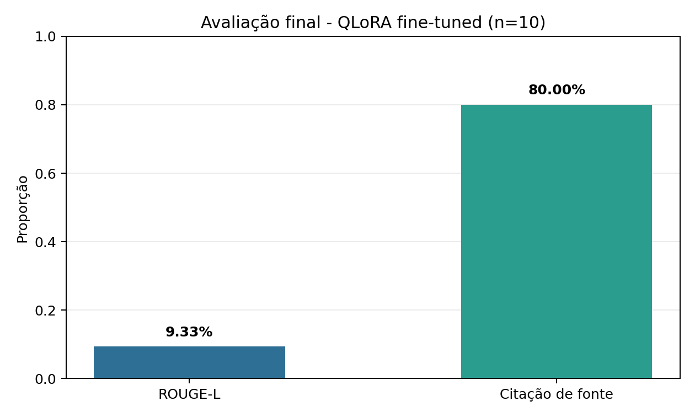

# Relatório Técnico - Tech Challenge Fase 3

## Assistente médico virtual com fine-tuning QLoRA, RAG e LangGraph

**Pós-graduação:** IA para Devs  
**Instituição:** FIAP + Alura  
**Fase:** Fase 3  
**Desafio:** Tech Challenge  

**Integrante:**  
- Fábio Rodrigues Barbosa

**Data:** 15/09/2026

## Links da entrega

- **Repositório Git:**
[https://github.com/fabiorbarbosa/pos-tech-fiap/tree/main/fase-03/tech-challenge](https://github.com/fabiorbarbosa/pos-tech-fiap/tree/main/fase-03/tech-challenge)
- **Vídeo de demonstração:**
[https://vimeo.com/1210042989](https://vimeo.com/1210042989)

## 1. Introdução

Este projeto apresenta um assistente médico virtual para apoio à decisão clínica, desenvolvido no contexto do Tech Challenge da Fase 3 da pós-graduação IA para Devs. A solução combina fine-tuning de uma LLM com dados médicos sintéticos, recuperação de protocolos institucionais e um fluxo orquestrado para consulta de prontuário, aplicação de guardrails, geração de resposta e auditoria.

O objetivo não é substituir o julgamento médico nem emitir prescrição. O assistente organiza informações de protocolos e do prontuário sintético para apoiar uma resposta contextualizada, sempre com indicação das fontes utilizadas e com mecanismos explícitos de bloqueio para solicitações inadequadas.

## 2. Definição do problema

O cenário proposto representa um hospital que deseja disponibilizar aos médicos um assistente capaz de responder dúvidas sobre condutas institucionais, consultar informações estruturadas de pacientes e sugerir procedimentos com base em protocolos internos.

O problema possui três necessidades complementares:

- adaptar uma LLM ao domínio médico institucional;
- recuperar conteúdo confiável de protocolos e combinar esse conteúdo ao contexto do paciente;
- controlar riscos de uso por meio de limites de atuação, validação humana e trilha de auditoria.

Por se tratar de um domínio sensível, a entrega foi estruturada como apoio à decisão. Respostas que envolvem prescrição direta são bloqueadas e respostas com dose ou posologia exigem validação médica obrigatória.

## 3. Base utilizada

A base utilizada é integralmente sintética. Não há dados reais de pacientes, profissionais ou prontuários. O conjunto reproduz apenas o formato de informações internas necessárias para demonstrar o fluxo técnico.

Os arquivos de origem estão em `data/seed/`:

- `protocols.json`: 10 protocolos institucionais, incluindo sepse, síndrome coronariana aguda, diabetes tipo 2, TEV e insuficiência cardíaca;
- `faq.json`: 14 perguntas frequentes com respostas que citam fontes;
- `templates.json`: modelos de laudo, receituário e checklist de procedimento.

O pipeline de curadoria aplica anonimização de identificadores pessoais, deduplicação de perguntas, enriquecimento com variações de contexto e divisão holdout reprodutível de 80/20. Como resultado, foram gerados `41` exemplos de treino em `train.jsonl` e `10` exemplos de avaliação em `eval.jsonl`.

Essa escolha mantém o trabalho aderente ao escopo acadêmico e à LGPD, sem apresentar dados sintéticos como se fossem evidência clínica real.

## 4. Fine-tuning e modelagem

O modelo base escolhido foi `Qwen/Qwen2.5-0.5B-Instruct`. O seu porte permite demonstração local e fine-tuning com recursos acessíveis, mantendo compatibilidade com execução em GPU de Colab e com validações locais em Apple Silicon.

O fine-tuning foi implementado com QLoRA, usando quantização NF4 de 4 bits e adaptadores LoRA com `r=16` e `alpha=32`. O treinamento supervisionado utiliza `SFTTrainer`, template de chat do tokenizer e os seguintes parâmetros principais:

- 3 épocas;
- learning rate `2e-4` com scheduler cosseno;
- batch size `4` com acumulação `4`;
- sequência máxima `1024`;
- avaliação em holdout separado do treino.

O notebook `notebooks/finetuning_colab.ipynb` documenta a execução em GPU. O comando `python -m src.fine_tuning.train --dry-run` valida localmente os dados, o prompt e a tokenização sem iniciar o treinamento completo.

## 5. Arquitetura do assistente

O assistente foi construído de forma modular em Python. O fluxo principal usa LangChain e LangGraph, enquanto o prontuário é simulado em SQLite e os protocolos são recuperados por FAISS, com fallback lexical para o modo offline.

O fluxo implementado é:

1. receber pergunta e identificador opcional do paciente;
2. aplicar guardrail de entrada;
3. consultar contexto do prontuário e protocolos relevantes;
4. gerar resposta com o contexto recuperado;
5. validar a saída e incluir fontes;
6. registrar auditoria estruturada em JSONL.

Os componentes principais estão organizados em `src/assistant/`, `src/db/`, `src/data_prep/` e `src/fine_tuning/`. Essa separação permite reproduzir e testar o fluxo sem depender de interface gráfica ou de dados externos.

## 6. Segurança, explicabilidade e auditoria

A solução possui três camadas de controle:

- **Guardrails de entrada:** bloqueiam pedidos de prescrição ou ajuste direto e redirecionam cenários de emergência para atendimento imediato.
- **Validação de saída:** adiciona aviso de validação médica quando há menção a dose ou posologia e exige a indicação das fontes recuperadas.
- **Auditoria:** grava cada interação em `logs/audit.jsonl`, com pergunta, resposta, paciente, fontes citadas, status de bloqueio e necessidade de validação humana.

Os protocolos recuperados incluem identificadores como `PROT-001`, o que permite rastrear a origem da resposta. O modo `--mock` utiliza busca lexical local e não inicializa embeddings, índice vetorial ou rede, preservando uma demonstração realmente offline.

## 7. Experimentos e resultados

A avaliação utiliza o holdout de `10` exemplos e duas métricas: ROUGE-L médio, como medida de similaridade lexical com a resposta de referência, e taxa de citação de fonte, como proxy de explicabilidade.

Resultados consolidados:

| Variante | Itens avaliados | ROUGE-L médio | Taxa de citação de fonte |
|---|---:|---:|---:|
| Qwen2.5-0.5B-Instruct base | 10 | 0.0671 | 0% |
| QLoRA fine-tuned | 10 | **0.0933** | **80%** |

O modelo fine-tuned apresentou aumento de ROUGE-L sobre a linha de base e, principalmente, passou a citar fontes na maior parte das respostas avaliadas. Esse resultado é relevante porque a fonte do protocolo é necessária para a conferência humana da resposta.

{ width=80% }

*Figura 1. ROUGE-L médio e taxa de citação de fonte na avaliação final do modelo QLoRA fine-tuned.*

Também foram executados cenários qualitativos em modo offline:

| Cenário | Resultado esperado | Resultado obtido |
|---|---|---|
| Conduta em protocolo | resposta com fontes | fontes de protocolo citadas |
| Prescrição direta | bloqueio do pedido | bloqueado pelo guardrail de entrada |
| Emergência | redirecionamento imediato | mensagem de orientação para atendimento imediato |
| Contexto do paciente | uso de prontuário | exames pendentes e fontes retornados |

Os artefatos de resultado estão em `results/eval_results_final.json` e `results/VALIDACAO_FINAL.md`.

## 8. Reprodução

Crie um ambiente Python 3.12 e instale as dependências:

```bash
pip install -r requirements.txt
```

Execute o fluxo de reprodução:

```bash
python scripts/setup_all.py
python tests/test_smoke.py
python main.py --mock --demo
python -m src.fine_tuning.train --dry-run
```

O pacote também contém um `Dockerfile` que executa o demo em modo `--mock`. A entrega final foi validada com sete smoke tests, demo offline e dry-run de treino.

## 9. Discussão crítica

Os resultados demonstram a viabilidade técnica de combinar adaptação leve de LLM, recuperação de conhecimento institucional e fluxo orquestrado para apoio à decisão. A separação entre protocolos, prontuário, guardrails e auditoria torna explícito o caminho usado para responder cada solicitação.

Entretanto, a solução não deve ser usada em produção clínica sem validação adicional. O dataset é sintético, a avaliação possui amostra pequena e a métrica ROUGE-L não mede segurança clínica. O modelo base de 0,5B também pode repetir trechos em inferência e não substitui revisão humana.

Como evolução, recomenda-se avaliar modelos maiores, ampliar o conjunto de avaliação, submeter protocolos e respostas a revisão clínica formal e reforçar a validação semântica dos guardrails.

## 10. Conclusão

O projeto atende ao objetivo da Fase 3 ao entregar um assistente médico virtual modular, com fine-tuning QLoRA, recuperação de protocolos, consulta estruturada de prontuário, LangGraph, guardrails, auditoria e explicabilidade por fonte.

Além da implementação, a entrega inclui testes offline, notebook de fine-tuning, adaptador LoRA final, resultados de avaliação, visualização e instruções de reprodução. O trabalho permanece explicitamente posicionado como demonstrador acadêmico de apoio à decisão, sem substituir julgamento clínico ou validação médica.
